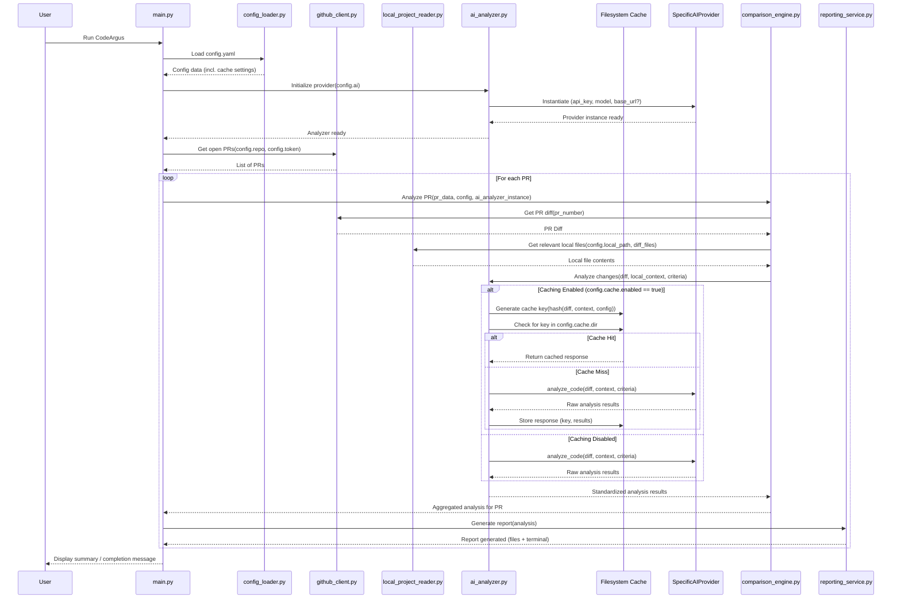

# CodeArgus: Project Plan

This document outlines the plan for building the CodeArgus AI pull request analysis tool.

## 1. Project Goal

To create a Python tool (`CodeArgus`) that automatically fetches open GitHub pull requests for a specified repository, analyzes the changes using a configurable AI model (Gemini, OpenAI, compatible local LLMs) against local project files, and generates rigorous, detailed feedback reports focusing on code quality, architecture, security, test coverage, and maintainability.

## 2. Project Structure

The project will be organized within the `c:\Users\JohanHolm\source\Misc\CodeArgus` directory as follows:

```
CodeArgus/
├── .gitignore
├── LICENSE
├── README.md
├── PLAN.md                     # This plan file
├── config.yaml.example         # Example configuration file
├── requirements.txt            # Python dependencies
├── .code_argus_cache/          # Default cache directory
│   └── .gitkeep
├── analysis_results/           # Default output directory for reports
│   └── .gitkeep
├── src/
│   ├── __init__.py
│   ├── main.py                 # Main entry point
│   ├── config_loader.py        # Handles loading/validating config
│   ├── github_client.py        # Interacts with GitHub API (using PyGithub)
│   ├── local_project_reader.py # Reads local project files
│   ├── ai_analyzer.py          # Interfaces with AI providers (multi-provider support + caching)
│   ├── comparison_engine.py    # Compares PR diffs with local code, checks tests
│   ├── reporting_service.py    # Generates reports (Markdown, terminal)
│   └── utils.py                # Common utility functions (logging, hashing, cache I/O)
└── tests/
    ├── __init__.py
    ├── test_config_loader.py
    ├── test_github_client.py
    ├── test_local_project_reader.py
    ├── test_ai_analyzer.py
    ├── test_comparison_engine.py
    ├── test_reporting_service.py
    └── fixtures/               # Test data (e.g., sample diffs, configs)
        └── .gitkeep
```

## 3. Core Components & Architecture

```mermaid
graph TD
    subgraph CodeArgus Tool
        A[main.py] --> B(config_loader.py);
        A --> C(github_client.py);
        A --> D(local_project_reader.py);
        A --> E(ai_analyzer.py);
        A --> F(comparison_engine.py);
        A --> G(reporting_service.py);
        A --> H(utils.py);

        C --> I{GitHub API via PyGithub};
        D --> J[Local Filesystem];
        E --> K{AI Provider Interface};
        K --> L{Cache Check};
        L -- Cache Miss --> M{Specific AI API (Gemini, OpenAI, etc.)};
        L -- Cache Hit --> N[Filesystem Cache];
        M --> N;  # Store result in cache
        N --> K;  # Return cached result
        F --> D;
        F --> C;
        F --> E;
        G --> O[analysis_results/];
        G --> P[Terminal Output];
    end

    style O fill:#f9f,stroke:#333,stroke-width:2px
    style P fill:#ccf,stroke:#333,stroke-width:2px
    style I fill:#f9d,stroke:#333,stroke-width:2px
    style M fill:#d9f,stroke:#333,stroke-width:2px
    style J fill:#9cf,stroke:#333,stroke-width:2px
    style N fill:#aec,stroke:#333,stroke-width:2px
```

*   **`config_loader.py`**: Loads `config.yaml`, validates schema, provides access to settings. Reads all values, including secrets like API keys and tokens, **directly** from the file. **Warning:** Storing secrets directly in configuration files is a security risk. Ensure `config.yaml` is properly secured and excluded from version control.
*   **`github_client.py`**: Uses the **`PyGithub` library** to interact with the GitHub API. Handles authentication using the token read from config, fetches open PRs, metadata, and diffs. Manages API interactions.
*   **`local_project_reader.py`**: Reads relevant files from the `local_project_path` specified in the config.
*   **`ai_analyzer.py`**:
    *   Supports multiple AI providers (Gemini, OpenAI, compatible local LLMs) via an adapter pattern (`AIProvider` interface).
    *   Instantiates the correct provider based on `config.yaml`.
    *   Includes a **filesystem caching layer** (controlled by config) to store/retrieve AI responses based on input hashes, reducing redundant API calls.
    *   Constructs detailed prompts focusing on configured `focus_areas` (undocumented changes, complexity, security, project impact, test coverage).
    *   Parses responses into a standardized format.
    *   Handles provider-specific settings (API keys, base URLs, models).
*   **`comparison_engine.py`**: Orchestrates analysis. Gets PR data, checks local project for test setup indicators (e.g., `tests/` dir, `pytest` in requirements), calls `ai_analyzer` with appropriate context and flags, aggregates results.
*   **`reporting_service.py`**: Formats results into Markdown reports (per PR, summary) and colored terminal output. Includes sections for overall project impact and test coverage feedback (if applicable). Saves reports to `analysis_results`.
*   **`main.py`**: Entry point; initializes components, iterates through PRs, triggers analysis, calls reporting.
*   **`utils.py`**: Shared functions (logging setup, input hashing for cache keys, safe cache file I/O).

## 4. Workflow (Simplified Sequence)



## 5. Configuration File (`config.yaml.example`)

```yaml
# CodeArgus Configuration Example
github:
  repository: "owner/repo-name" # e.g., "octocat/Spoon-Knife"
  token: "YOUR_GITHUB_API_TOKEN" # *** SECURITY WARNING: Use env variables or secrets management instead! ***
  # Optional: Base URL for GitHub Enterprise
  # base_url: "https://github.yourcompany.com/api/v3"

ai:
  # --- Provider Selection ---
  provider: "openai" # Options: "openai", "gemini", "anthropic" (future), "local_llm" (uses openai provider type)

  # --- Provider Specific Settings ---
  openai: # Settings for provider: "openai" or "local_llm"
    model: "gpt-4-turbo-preview" # Or "gpt-3.5-turbo", or your local model name
    api_key: "YOUR_OPENAI_API_KEY" # Use env vars/secrets! (Can be sk-..., or often 'ollama'/'none' for local)
    base_url: null # Set for local LLMs, e.g., "http://localhost:11434/v1" or Azure endpoint

  gemini: # Settings for provider: "gemini"
    model: "gemini-pro"
    api_key: "YOUR_GEMINI_API_KEY" # Use env vars/secrets!

  # anthropic: # Future settings for provider: "anthropic"
    # model: "claude-3-opus-20240229"
    # api_key: "YOUR_ANTHROPIC_API_KEY" # Use env vars/secrets!

  # --- General AI Settings ---
  temperature: 0.3 # Optional, provider-dependent interpretation
  max_tokens: 4000 # Optional, provider-dependent limit
  strictness_level: "high" # Controls prompt detail/tone (e.g., low, medium, high, pedantic)
  focus_areas: # Specific areas for harsh critique
    - "undocumented_changes"
    - "high_complexity"
    - "security_vulnerabilities"
    - "project_impact"
    - "test_coverage" # Conditionally applied based on project structure

project:
  local_path: "/path/to/your/local/project/clone" # Absolute or relative path to the codebase
  # Optional: Explicitly define test directory/markers if needed
  # test_indicators: ["tests/", "test/"]
  # test_dependency_markers: ["pytest", "unittest"] # Check requirements.txt/pyproject.toml

reporting:
  output_dir: "analysis_results" # Directory to save reports
  terminal_colors: true # Enable/disable colored terminal output
  # Optional: Log level (DEBUG, INFO, WARNING, ERROR)
  # log_level: "INFO"

cache: # Caching settings
  enabled: true # Set to false to disable caching
  directory: ".code_argus_cache" # Relative path for storing cache files
  # Optional: max_age_days: 7 # Future: For cache expiry
```

## 6. Technology Stack

*   **Language:** Python 3.11+
*   **GitHub API:** `PyGithub` library.
*   **AI:**
    *   `google-generativeai` library (for Gemini).
    *   `openai` library (for OpenAI, Azure, compatible local LLMs).
    *   *(Future: `anthropic` library)*
*   **Configuration:** `PyYAML` for YAML parsing.
*   **Terminal Output:** `rich` for formatted and colored output.
*   **Testing:** `pytest` framework.
*   **Dependency Management:** `pip` with `requirements.txt`.

## 7. Testing Strategy

*   Unit tests for each module.
*   Mock external services (GitHub API, AI APIs) during testing using `unittest.mock` or similar.
*   Use sample diffs, config files, and expected report outputs stored in `tests/fixtures/`.
*   Aim for high test coverage.

## 8. Caching Mechanism

*   A simple filesystem cache is implemented within `ai_analyzer.py`.
*   When enabled via `config.yaml`, it generates a unique key (hash of inputs + config).
*   Checks for a corresponding `.json` file in the cache directory.
*   If found (cache hit), returns the stored response.
*   If not found (cache miss), calls the actual AI provider API, then stores the result in the cache before returning it.
*   This reduces API calls and speeds up repeated analyses during development.